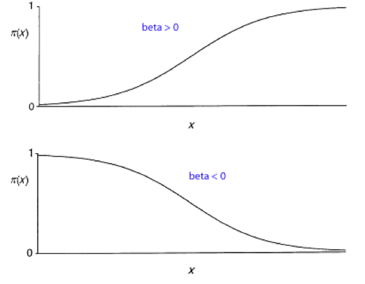

--- 
title: "Reinforcement Learning"
subtitle: "Ciencia de los Datos Financieros"
author: "Synergy Vision"
date: "2019-01-17"
knit: "bookdown::render_book"
documentclass: krantz
bibliography: [book.bib, packages.bib]
biblio-style: apalike
link-citations: yes
colorlinks: yes
lot: yes
lof: yes
fontsize: 12pt
monofontoptions: "Scale=0.8"
keep_md: yes
site: bookdown::bookdown_site
description: ""
url: 'http\://synergy.vision/Reinforcement-learning/'
github-repo: synergyvision/Reinforcement-learning/
cover-image: images/cover.png
---

# Prefacio {-}

Placeholder

## ¿Por qué  leer este libro? {-}
## Estructura del libro {-}
## Información sobre los programas y convenciones {-}
## Prácticas interactivas con R {-}
## Agradecimientos {-}

<!--chapter:end:index.Rmd-->

# Acerca del Autor {-}

Este material es un esfuerzo de equipo en Synergy Vision, (<http://synergy.vision/nosotros/>).		 

El propósito de este material es ofrecer una experiencia de aprendizaje distinta y enfocada en el estudiante. El propósito es que realmente aprenda y practique con mucha intensidad. La idea es cambiar el modelo de clases magistrales y ofrecer una experiencia más centrada en el estudiante y menos centrado en el profesor. Para los temas más técnicos y avanzados es necesario trabajar de la mano con el estudiante y asistirlo en el proceso de aprendizaje con prácticas guiadas, material en línea e interactivo, videos, evaluación contínua de brechas y entendimiento, entre otros, para procurar el dominio de la materia.
  		  
Nuestro foco es la Ciencia de los Datos Financieros y para ello se desarrollará material sobre: **Probabilidad y Estadística Matemática en R**, **Programación Científica en R**, **Mercados**, **Inversiones y Trading**, **Datos y Modelos Financieros en R**, **Renta Fija**, **Inmunización de Carteras de Renta Fija**, **Teoría de Riesgo en R**, **Finanzas Cuantitativas**, **Ingeniería Financiera**, **Procesos Estocásticos en R**, **Series de Tiempo en R**, **Ciencia de los Datos**, **Ciencia de los Datos Financieros**, **Simulación en R**, **Desarrollo de Aplicaciones Interactivas en R**, **Minería de Datos**, **Aprendizaje Estadístico**, **Estadística Multivariante**, **Riesgo de Crédito**, **Riesgo de Liquidez**, **Riesgo de Mercado**, **Riesgo Operacional**, **Riesgo de Cambio**, **Análisis Técnico**, **Inversión Visual**, **Finanzas**, **Finanzas Corporativas**, **Valoración**, **Teoría de Portafolio**, entre otros.

Nuestra cuenta de Twitter es (https://twitter.com/bysynergyvision) y nuestros repositorios están en GitHub (https://github.com/synergyvision).
  		  
 **Somos Científicos de Datos Financieros**

<!--chapter:end:000-author.Rmd-->

# Introducción 

Placeholder

## Reinforcement Learning
## Ejemplos
## Elementos del Reinforcement Learning
## Limitaciones y alcance
## Un ejemplo clásico: tres en linea.     

<!--chapter:end:010-introduction.Rmd-->

# Modelos Lineales 

En estadística, el término modelo lineal es usado en diferentes maneras de acuerdo al contexto. La manera más frecuente es en conexión con modelos de regresión y el término a menudo se toma como un sinónimo del modelo de regresión lineal.

## Regresión lineal 

Permite determinar el grado de dependencia de las series de valores X e Y, prediciendo el valor y estimado que se obtendría para un valor x que no está en la distribución.

El modelo de regresión lineal simple tiene la siguiente expresión: 

$$Y= \beta_0 + \beta_1 X + \varepsilon$$

En esta expresión estamos admitiendo que todos los factores o causas que
influyen en la variable respuesta Y pueden dividirse en dos grupos: el primero
contiene a una variable explicativa X y el segundo incluye un conjunto amplio de
factores no controlados que englobaremos bajo el nombre de perturbación o error
aleatorio, $\varepsilon$, que provoca que la dependencia entre las variables dependiente e independiente no sea perfecta, sino que está sujeta a incertidumbre.

Lo que sería deseable en un modelo de regresión es que
estos errores aleatorios sean en media cero para cualquier valor x de X, es decir,
$E[\varepsilon/X = x] = E[\varepsilon]=0$, y por lo tanto:

$$E [Y /X = x] = \beta_0 + \beta_1x + E [\varepsilon/X = x] = \beta_0 + \beta_1x$$

De la expresión anterior se observa: 

*  La media de $Y$, para un valor fijo $x$, varía linealmente con $x$.
* Para un valor $x$ se predice un valor en $Y$ dado por $\hat y = E[Y /X = x] = \beta_0 + \beta_1 x$, por lo que el modelo de predicción puede expresarse también
como $\hat Y = \beta_0 + \beta_1 X$.

* El parámetro $\beta_0$ es la ordenada al origen del modelo (punto de corte con
el eje $Y$) y $\beta_1$ la pendiente, que puede interpretarse como el incremento de
la variable dependiente por cada incremento en una unidad de la variable
independiente. Estos par??metros son desconocidos y habrá que estimarlos
de cara a realizar predicciones.

Además de la hipótesis establecida sobre los errores de que en media han de
ser cero, se establecen las siguientes hipótesis:

Para hacer una estimación del modelo de regresión lineal simple, trataremos de buscar una
recta de la forma:

2) La varianza de $\varepsilon$ es constante para cualquier valor de $x$, es decir, $Var(\varepsilon/X = x) = \sigma^ 2$

3) La distribución de $\varepsilon$ es normal, de media 0 y desviación $\sigma$.

4) Los errores asociados a los valores de $Y$ son independientes unos de otros.

En consecuencia, la distribución de $Y$ para $x$ fijo es normal, con varianza
constante $\sigma^ 2$, y media que var??a linealmente con $x$, dada por $\beta_0 + \beta_1 x$. Adem??s
los valores de $Y$ son independientes entre sí.

## Estimación de los parámetros del modelo

Partimos de una muestra de valores de X e Y medidos sobre n individuos:
$(x_1, y_1),(x_2, y_2), ...,(x_n,y_n)$, y queremos estimar valores en Y según el modelo $$\hat Y=  \beta_0 +  \beta_1 X$$. Debemos encontrar entonces de entre todas las rectas la que mejor se ajuste a los datos observados, Para
un valor $x_i$, el modelo estima un valor en Y igual a 
$\hat y_i = \beta_0 + \beta_1 x_i$ y el valor
observado en Y es igual a $y_i$, con lo cual el error de estimación en ese caso
vendría dado por $e_i = y_i - \hat y_i = y_i - (\beta_0 + \beta_1 x_i)$.Entonces tomaremos como
estimaciones de $\beta_0$ y $\beta_1$ , que notamos por $\hat \beta_0$ y $\hat \beta_1$ , aquellos valores que hagan mínima la suma de los errores al cuadrado, que viene dada por:

$$SSE= \sum_{i=1}^{n} e_i ^2= \sum_{i=1}^{n} (y_i - \hat y_1)^ 2 = (y_i - (\beta_0 + \beta_1 x_1 ))^2$$
Al método de estimación se le llame método de mínimos cuadrados. La solución se obtiene, derivando SSE con respecto a $\beta_0$ y $\beta_1$ e igualando a 0. Los estimadores resultan:

$$\hat \beta_1 = \frac{SS_{xy}}{SS_{xx}}$$
$$\hat \beta_0 = \bar y - \hat \beta_1 \bar x $$

Donde $SS_{xy}$ y $SS_{xx}$ son:

$$SS{xy}= \sum_{i=1}^{n}(x_i - \bar x)(y_i - \bar y)= \sum_{i=1}^{n}x_i y_i - n \bar x \bar y ,$$

$$SS_{xx}= \sum_{i=1}^{n}(x_i - \bar x)^2= \sum_{i=1}^{n} x_i ^2 - n \bar x ^2= n \sigma_x ^2$$

Luelo la recta de regresión lineal de $Y$ sobre $X$ es, $\hat Y = \hat \beta_0 - \hat \beta_1 X$

$$\hat Y= \hat \beta_0 + \hat \beta_1 X$$

El siguiente parámetro a estimar en el modelo es la varianza de los errores ($\sigma^2$). A su estimador se le denomina varianza residual y viene dada por:

$$\hat s_R ^2 = \frac {SSE}{n-2}= \frac{\sum_{i=1}^{n} e_i}{n-2}= \frac{SS_{yy}- \hat \beta_1 SS_{xy}}{n-2}$$

## Regresión Lineal Múltiple

El modelo de regresión lineal múltiple es uno de los modelos más utilizados entre todos los modelos estadísticos. En la mayoría de las situaciones prácticas en las que se quiere explicar una variable continua Y se dispone de muchas potenciales variables predictoras. Usualmente, el modelo de regresión lineal simple provee una descripción inadecuada de la respuesta ya que suele suceder que son muchas las variables que ayudan a explicar la respuesta y la afectan de formas distintas e importantes. Entonces es necesario trabajar con modelos más complejos, que contengan variables predictoras adicionales, para proporcionar predicciones más precisas y colaborar en la cuanti􏰀cación del vínculo entre ellas. En este sentido, el modelo de regresión múltiple es una extensión natural del modelo de regresión lineal simple, aunque presenta características propias que es de interés estudiar en detalle.
El modelo de regresión múltiple se puede utilizar tanto para datos observacionales como para estudios controlados a partir de ensayos aleatorizados o experimentales.

El modelo de regresión lineal múltiple es un modelo para la variable aleatoria $Y$
cuando se conocen $X_1, X_2, \cdots, X_{p-1}$ las variables regresoras. El modelo es

$$Y_i=\beta_0 + \beta_1X_{i1}+ \beta_2 X_{i2}+ \cdots + \beta_{p-1}X_{ip-1}+ \varepsilon_i,$$

donde $\beta_0, \beta_1, \cdots, \beta_{p-1}$ son parámetros númericos desconocidos, $X_{i1}, X_{i2}, \cdots, X_{ip-1}$ son las variables independientes o predictoras en la i-ésima posición, con $1 ≤ i ≤ n$, $n$ es el tamaño de muestra, $Y_i$ es la variable dependiente o variable de respuesta en la i-ésima posición y $\varepsilon_i$ es el error en esa misma i-ésima posición. Supongamos que: 

$\varepsilon_i ∼ N(0, \sigma^2)$, $1≤i≤n$, independientes entre sí, es decir, 

-Los $\varepsilon_i$ tienen media cero, $E(\varepsilon_i)=0$.

-Los $\varepsilon_i$ tienen todos la misma varianza desconocida que llamaremos $\sigma^2$ y que es el otro parámetro del modelo, $Var (\varepsilon_i) = \sigma^2$.

-Los $\varepsilon_i$ tienen distribución normal.

-Los $\varepsilon_i$ son independientes entre sí, e independientes de las covariables $X_{i1}, X_{i2}, \cdots, X_{ip-1}$.

Si definimos $X_{i0}=1$, para todo $i$, podemos reescribir el modelo de la siguiente manera

$$Y_i=\beta_0 + \beta_1X_{i1}+ \beta_2 X_{i2}+ \cdots + \beta_{p-1}X_{ip-1}+ \varepsilon_i= \sum_{j=0}^{p-1} \beta_jX_{ij}+\varepsilon_i .$$
Del hecho de que los $\varepsilon$ son independientes y tienen distribución $N(0,\sigma^2)$ se deduce que condicional a $X_{i1}, X_{i2}, \cdots, X_{ip-1},Y_i ∼ N(\sum_{j=0}^{p-1} \beta_jX_{ij}, \sigma^2)$, independientes entre sí. 

## Modelo de Regresión Lineal en notación matricial

Ahora presentaremos el modelo en notación matricial. Definimos: 

$Y=\begin{bmatrix}Y_1 \\ Y_2\\ \vdots \\ Y_n \end{bmatrix}_{n\times 1}$ 
$X= \begin{bmatrix} 1 &X_{11} & X_{12}& \cdots & X_{1p-1} \\ 1 &X_{21} & X_{22}& \cdots & X_{2p-1} \\ \vdots & \vdots & \vdots & \ddots& \vdots \\ 1& X_{n1}& X_{n2} & \cdots & X_{np-1}\end{bmatrix}_{n\times p}$
$\beta=\begin{bmatrix} \beta_0 \\ \beta_1\\ \vdots \\ \beta_p-1 \end{bmatrix}_{p\times 1}$
$\varepsilon = \begin{bmatrix} \varepsilon_1 \\ \varepsilon_2  \\ \vdots \\ \varepsilon_n\end{bmatrix}_{n\times 1}$

Así, el modelo de forma matricial se escribe de la siguiente manera: 

$$Y= X \beta + \varepsilon$$
Donde,

$Y$ es un vector de respuestas,
$\beta$ es un vector de parámetros,
$X$ es una matriz de covariables,
$\varepsilon$ es un vector de variables aleatorias normales independientes con esperanza $E (\varepsilon) = 0$ y matriz de varianzas y covarianzas,

$$Var(\varepsilon)= \begin{bmatrix}\sigma^2 &0 & \cdots & 0 \\ 0 & \sigma^2 & \cdots &0\\ \vdots & \vdots& \ddots& \vdots \\ 0 & 0 & \cdots &\sigma^2 \end{bmatrix}= \sigma^2I$$

Tomando condicional a las variables $X$, la esperanza de $Y$ resulta ser

$$E(Y/X)=X\beta$$
y la matriz de covarianza de las $Y$ resulta ser la misma que la de $\varepsilon$

$Var(Y/X)= \sigma^2 I$

## Estimación de los Parámetros 

Usamos el método de mínimos cuadrados para ajustar el modelo. O sea, de􏰀nimos la siguiente función

$$g(b_0, b_1, \cdots, b_{p-1})= \sum_{i=1}^n (Y_i- b_0X_{i0} - b_1X_{i1} - b_2 X_{i2} - \cdots - b_{p-1}X_{ip-1})^2$$ 
y los estimadores $\hat \beta_0, \hat \beta_1, \cdots, \hat \beta_{p-1}$ serán aquellos valores de $b_o, b_1, \cdots, b_{p-1}$ que minimicen a g. Los llamaremos estimadores de mínimos cuadrados y denotaremos el vector coeficiente como $\hat \beta$

$\hat \beta=\begin{bmatrix} \hat \beta_0 \\ \hat \beta_1\\ \vdots \\\hat  \beta_p-1 \end{bmatrix}_{p\times 1}$

Las ecuaciones de mínimos cuadrados normales para el modelo de regresión lineal
general son:

$$X^t X \hat \beta= X^t Y$$

donde $X^t$ quiere decir la matriz traspuesta. Los estimadores de mínimos cuadrados son:

$$\hat \beta= (X^t X)^{-1} X^t Y $$
Observaciones 

-Para encontrar los estimadores de β no se necesita que los errores sean normales.
-En el caso de la regresión lineal, los estimadores de mínimos cuadrados de los betas coinciden también con los estimadores de máxima verosimilitud para el modelo antes descripto, es decir, cuando se asume normalidad de los errores.

## Valores Ajustados y Residuos

Denotemos al vector de valores ajustados $\hat Y_i$ por $\hat Y$ y al vector de residuos $e_i= Y_i - \hat Y_i$ por $e$

$\hat Y=\begin{bmatrix}\hat Y_1 \\ \hat Y_2\\ \vdots \\ \hat Y_n \end{bmatrix}_{n\times 1}$ $e=\begin{bmatrix}e_1 \\ e_2\\ \vdots \\ e_n \end{bmatrix}_{n\times 1}$ 

Los valores ajustados se calculan de la siguiente manera

$$\hat Y = X\hat \beta= X(X^t X)^{-1} X^t Y$$

Los residuos se escriben matricialmente como:

$$ e= Y - \hat Y = Y - X \hat \beta = Y -X(X^tX)^{-1} X^t Y= (I- X(X^tX)^{-1} X^t)Y$$
 Renombraremos $H= X(X^tX)^{-1} X^t \in \mathbb{R}^{n \times n}$.
 
 Tenemos que
 
 $\hat Y= HY$ y $e=(I-H)Y$
 
 La matriz de varianzas de los residuos es:
 
 $$ Var(e)= \sigma^2 (I-H)$$

## Observaciones

1. (Residuos): El modelo de regresión lineal impone que los errores $\varepsilon_i$ sean independientes, normales y tengan todos la misma varianza. Los errores no son observables, los residuos $ei$, que son el correlato empírico de los errores, son observables. Sin embargo, los residuos no son independientes entre sí y sus varianzas no son iguales.

2. (Teórica): $H$ y $I-H$ son matrices de proyección (es decir, $H^2=H$ y $(I-H)^2=I-H$). $H$ proyecta el subespacio de $\mathbb{R}^n$ generado por las columnas de $X$.

## Modelos Lineales Generalizados (GLM)

### Componentes de un modelo lineal generalizado (GLM)

Un modelo lineal generalizado tiene tres componentes básicos:

-  **Componente aleatoria:** Identifica la variable respuesta y su distribución de probabilidad.

- **Componente sistemática:** Especifica las variables explicativas (independientes o predictoras) utilizadas en la función predictora lineal.

- **Función link:** Es una función del valor esperado de $Y,  E(Y)$, como una combinación lineal de las variables predictoras.

**Componente aleatoria**

La componente aleatoria de un GLM consiste en una variable aleatoria $Y$ con observaciones independientes $(y_1, \cdots, y_N )$. Suponemos la distribución de Y en la familia exponencial natural.

$$f(y_i| \theta_i)= a(\theta_i) b(y_i) e^{[y_iQ(\theta_i)]}$$

$\theta_i$ varia para los distintos $i$ dependiendo de los valores de las variables predictoras.

$Q(\theta)$ recibe el nombre de parámetro natural.

**Componente sistemática**

La coponente sistemática de un GLM especifica las variables explicativas, que entran en forma de efectos fijos en un modelo lineal, es decir, las variables $x_j$ se relacionan mediante

$$\alpha+ \beta_{1} x_1+ \cdots+ \beta_k x_k$$
Esta combinación lineal se denomina predictor lineal.

también se puede expresar como un vector $(\eta_1, \cdots, \eta_N)$ tal que 

$\eta_i = \sum_{j} \beta_j x_{ij}$ con $i=1, \cdots, N$

donde $x_{ij}$ es el valor del j-ésimo predictor en la i-ésima posición.

términoo independiente $\alpha$ se obtendría con esta notación haciendo que todos los $x_{ij}$ sean igual a 1 para todos los i. 

**Función Link**

La esperanza de $Y$ la denotamos por $E(Y) = \mu$. La función link específica una función $g(\cdot)$ que relaciona $\mu$ con el predictor lineal de la siguiente manera

$$g(\mu)= \alpha + \beta_{1} x_1+ \cdots+ \beta_k x_k.$$

De esta manera la función link relaciona las componentes aleatoria y sistemática.

Luego, para $i= 1, \cdots, N$ tenemos que,

$$\mu_i= E(Y_i)$$

$$\eta_i= g(\mu_i)= \sum_{j} \beta_j x_{ij}$$

## Modelos Lineales Generelizados para datos binarios

Se define una respuesta binaria asignada de la siguiente manera 1 en caso de éxito y 0 en elfracaso, esto es, $Y ∼ Bin(1,\pi)$. En este caso,

$$f(y|\pi)= \pi^y(1-\pi)^{1-y}\\
          =(1-\pi)\left(\dfrac{\pi}{1-\pi}\right)^y\\
          =(1-\pi)e^{y log \left( \dfrac{\pi}{1 - \pi}\right)}$$

con $y= 0,1$. 

El parámetro natural es 
$$Q(\pi)=log \left( \dfrac{\pi}{1-\pi} \right) = logit(\pi)$$

en este caso tenemos

$$E(Y)= P(Y=1)=\pi(x)$$
dependiente de p variables explicativas o independientes $x= (x_1, \cdots,x_p)$, luego

$$Var(Y) =\pi(x)(1-\pi(x)).$$

## Regresión Logística 

Por lo general las relaciones entre $\pi(x)$ y $x$ no son lineales, la relación habitualmente tiene forma de curva en forma sigmoidal 

 

Representada por la fórmula: 

$$\pi(x)= \dfrac{e^{\alpha+\beta x}}{1 + e^{\alpha+\beta x} }$$

Llamada función logística de la que se derivan los modelos de regresión logística:

$$1- \pi(x) =1 - \dfrac{e^{\alpha+\beta x}}{1 + e^{\alpha+\beta x} } \\
= \dfrac{1}{1 + e^{\alpha+\beta x} }$$

Opererando obtenemos

$$\dfrac{\pi(x)}{1- \pi(x)}= e^{\alpha+\beta x}$$

Despejando $\alpha+\beta x$ tenemos lo siguiente

$$log \left( \dfrac{\pi(x)}{1- \pi(x)} \right) = \alpha+\beta x$$

La función link $log \left( \dfrac{\pi(x)}{1- \pi(x)} \right)$ de $\pi$ se denomina funcioón logit, de modo que así se asegura que no habra problemas estructurales respecto al rango de valores de $\pi$. El parámetro $\beta$ dtermina el rango y la velocidad de crecimiento o decrecimiento de la curva.

## Regresión Probit

Una idea natural es 

$$\pi(x)= F(x),$$

siendo $F$ una función de distribución. Cuando $X$ es una variable aleatoria continua, la funcion de distribucion de x tiene forma de $S$. Esto sugiere una clase de modelos de dependencia para modelos binarios.

Como caso particular se puede considerar el link probit que transforma probabilidades en valores estándar de la funcion de distribución normal, $F(x)=\Phi(x)$.

$$\pi(x)= \Phi(\alpha+ \beta x) \\ \Phi^{-1}(\pi(x))= \alpha + \beta x$$
Así $\Phi^{-1}$ define un modelo probit.

Nota: en la práctica los modelos logit y probit prodicen ajustes similares. 

<!--chapter:end:100-capitulo1.Rmd-->

# Procesos de decision de Markov finitos

Placeholder

##  El agente, Un interface del entorno
## Metas y recompensas.
## Retornos y episodios
## Notación unificada tanto para tareas episodicas y continuas.
## Políticas y funciones de valor
## Funciones de valor y políticas optimas
## Optimalidad y aproximación

<!--chapter:end:200-capitulo2.Rmd-->

# Programación dinámica

Placeholder

## Políticas evaluadas (Predicción)
## Mejora de las políticas
## Iteración de políticas
## Iteración de valores 
## Programación dinámica asincrónica.
## Iteración generalizada de políticas
## Eficiencia de la programación dinámica

<!--chapter:end:201-capitulo3.Rmd-->

# Métodos de Montecarlo

Placeholder

## Predicción con Monte Carlo
## Estimación de Monte Carlo de los Valores de Acción
## Métodos de Monte Carlo con control
## Métodos de Monte Carlo con control sin iniciar exploración
## Predicciones no políticas via muestreos de importancia.
## Implementación incremental
## Monte Carlo no político con control

<!--chapter:end:202-capitulo4.Rmd-->

# Aprendizaje por Diferencia Temporal

Placeholder

## Predicción
## Ventajas de los métodos de predicción de TD
## Calidad de TD(0)
## Sarsa: TD político con control 
## Q-Learning: TD no político con control 
## Sarsa esparada
## Sesgo de maximización y doble aprendizaje
## Juegos, afterstates y otros casos especiales

<!--chapter:end:203-capitulo5.Rmd-->

# Bootstrapping en $n$-pasos

Placeholder

## Predicción de TD en $n$ pasos

<!--chapter:end:204-capitulo6.Rmd-->

# (APPENDIX) Apéndice {-}

Placeholder

# Software Tools

Placeholder

## R and R packages
## Pandoc
## LaTeX

<!--chapter:end:400-apendice.Rmd-->

# Referencias {-}

<!--chapter:end:500-references.Rmd-->

